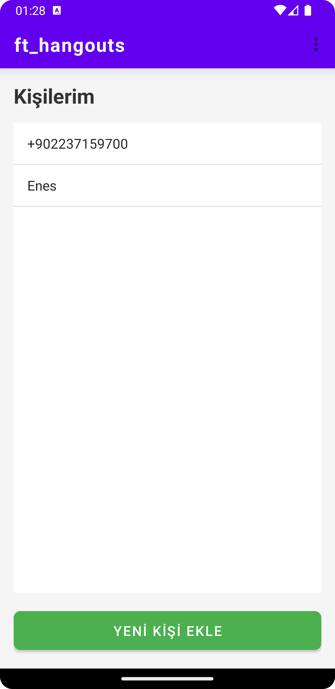
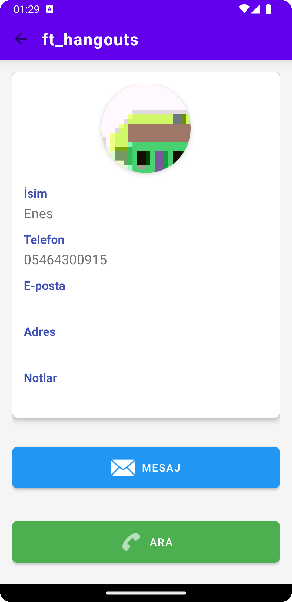
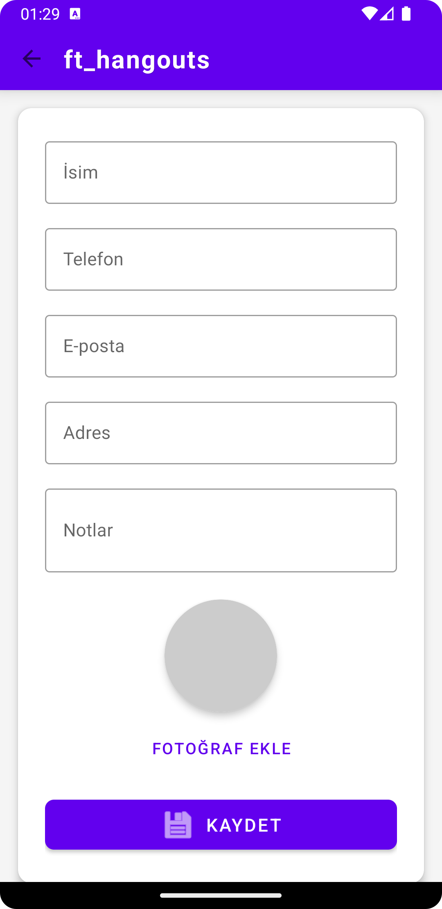

# hangly
#### Score: 125/125

## Overview
hangly is a mobile application developed with Kotlin, replicating basic messaging functionality similar to popular messaging services. This project is part of the 42 curriculum, designed to explore mobile development concepts using Kotlin programming language and Android frameworks.

## Features
- **Contact Management**: Create, edit, and delete contacts with their name, phone number, and optional photo
- **Messaging**: Send and receive text messages with contacts
- **Notifications**: Receive notifications when messages arrive
- **Themes**: Switch between different color themes
- **Device Rotation**: Support both portrait and landscape modes
- **Data Persistence**: Contacts and messages are stored locally

## Technical Specifications
- **Language**: Kotlin
- **Database**: SQLite/Core Data
- **Target Platform**: Android

## Installation & Usage
1. Clone this repository
```bash
git clone https://github.com/fleizean/hangly.git
```
2. Open the project in Android Studio
```bash
cd hangly
```
3. Build and run the application in the Android Emulator or on a physical device

## Screenshots

<div align="center">
    
    
    
</div>
